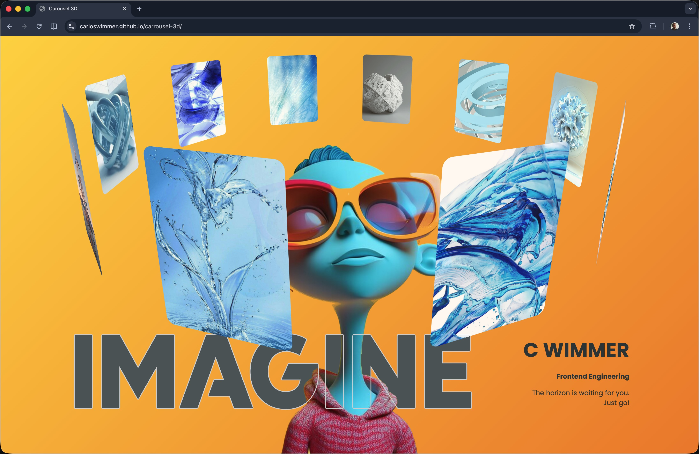

# Portfolio — Carlos Wimmer

[**View live on GitHub Pages →**](https://carloswimmer.github.io/portfolio/)



<p align="center">
  <a href="https://carloswimmer.github.io/portfolio/"></a>
  <a href="LICENSE"></a>
  <a href="https://developer.mozilla.org/docs/Web/HTML"></a>
  <a href="https://developer.mozilla.org/docs/Web/CSS"></a>
</p>

A **personal portfolio** site built with **pure HTML and CSS**. A rotating 3D carousel on the home page showcases selected projects, with links to LinkedIn and GitHub.

There is **no JavaScript** in this application. All motion comes from **CSS animations and transitions**, including the carousel rotation and cross-document **View Transitions** when navigating between the home page and project detail views.

## Purpose

This site is my **public portfolio**: a single-page entry point that presents my work and professional profiles in a distinctive, interactive layout—without frameworks, build tools, or client-side scripts.

## Features

- **No JavaScript** — structure and styling only; behavior is driven by HTML and CSS
- **3D carousel** — project cards arranged on a circle with depth, perspective, and a continuous CSS animation
- **Project detail pages** — each carousel item links to a dedicated page under `view/` with a full-size preview and an external link to the live project
- **View Transitions** — navigating between the home page and project pages uses the cross-document View Transitions API in supporting browsers (e.g. Chromium); other browsers fall back to normal navigation
- **Reduced motion** — `prefers-reduced-motion` shortens or disables decorative animations and view transitions
- **Responsive-minded layout** — styled for a strong full-page presentation on desktop and mobile

## Deployment

The site is published as a **GitHub Pages project site** from this repository, available at:

**https://carloswimmer.github.io/portfolio/**

All internal links use **relative paths** so navigation works correctly under the `/portfolio/` base path.

## Run locally

Clone the repo and open `index.html` in a browser (double-click or use your OS file command).

To exercise **cross-document View Transitions** (home ↔ project pages), serve the project over HTTP (for example `python3 -m http.server` from the repo root) and open `http://localhost:8000/`. Opening files via `file://` may not run the transition animation reliably.

```sh
git clone https://github.com/carloswimmer/portfolio.git
cd portfolio
```

**macOS**

```sh
open index.html
```

**Windows**

```sh
start index.html
```

**Linux (xdg-open)**

```sh
xdg-open index.html
```

## Browser notes

View Transitions are a **progressive enhancement**. In Chromium-based browsers, navigation between the carousel and project pages animates smoothly. In other engines, pages load instantly with no animation—functionality is unchanged.

## License

This project is released under the [MIT License](LICENSE).
